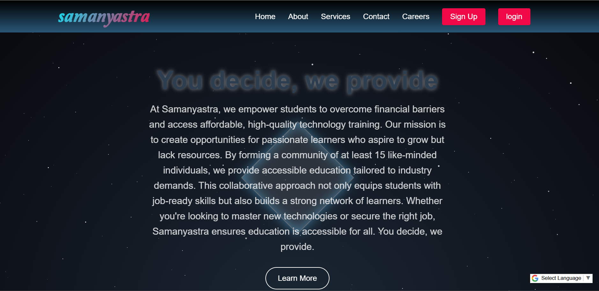
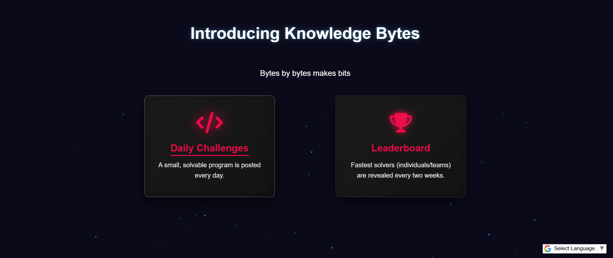
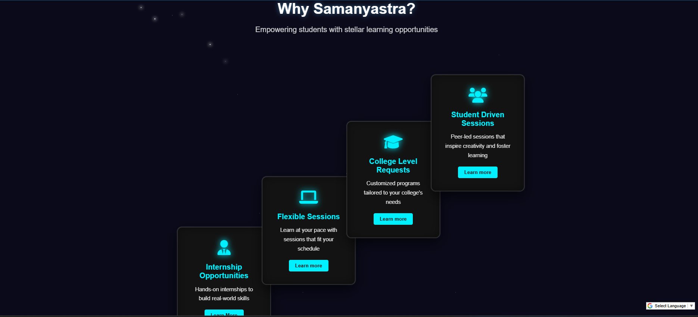
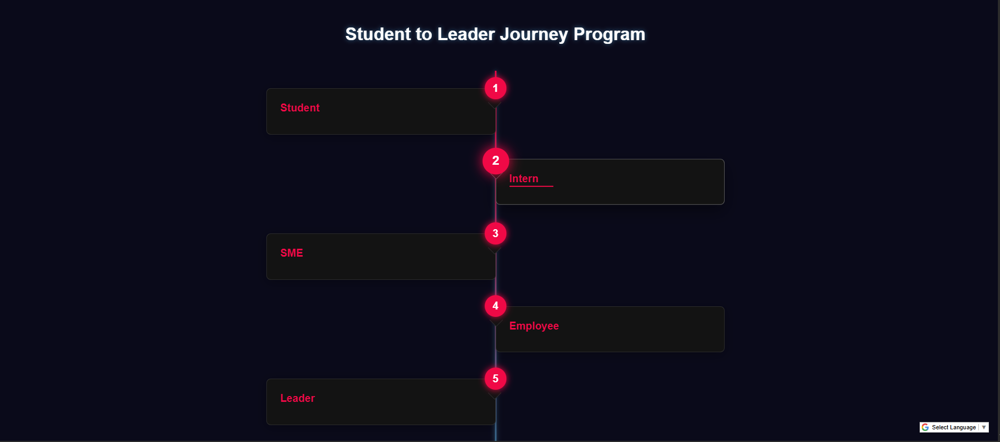
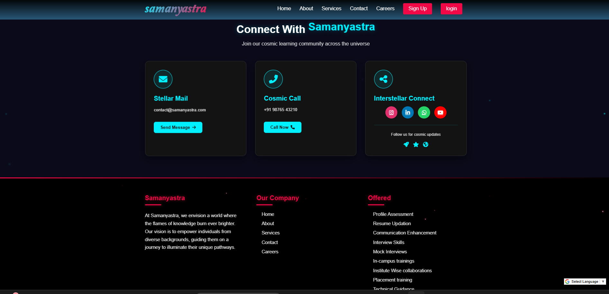

# Samanyastra Website Clone

A responsive clone of the Samanyastra news website built with HTML, CSS, and JavaScript.

  


  


  


  


  

## 🔗 Live Demo  
[View Live Demo](https://samanyastra-website.netlify.app/)  


## Features

- 📰 Replica of Samanyastra's homepage layout
- 📱 Fully responsive design (mobile/tablet/desktop)
- 🎨 CSS animations for interactive elements
- 🔍 Functional search bar (UI only or with JS implementation)
- 📅 Date/time display matching the original

## Technologies Used

- HTML5
- CSS3 (Flexbox/Grid)
- JavaScript (for dynamic elements)
- [Font Awesome](https://fontawesome.com/) (for icons)
- Google Fonts (for typography)

## Installation

1. Clone the repository:
   ```bash
   git clone https://github.com/Gangavane412/samanyastra-Clone